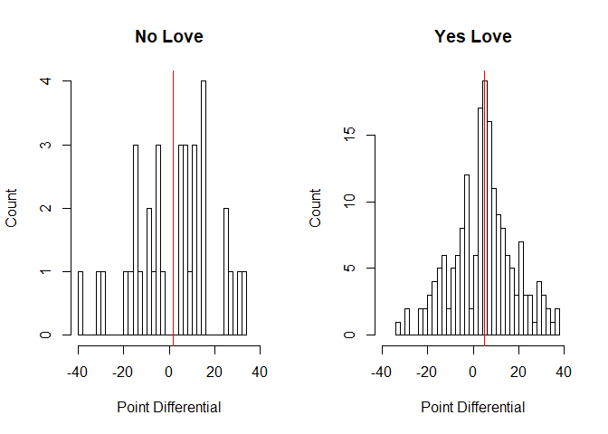
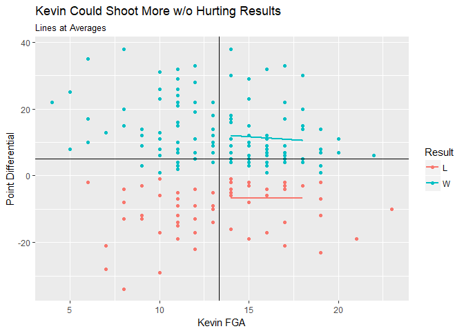
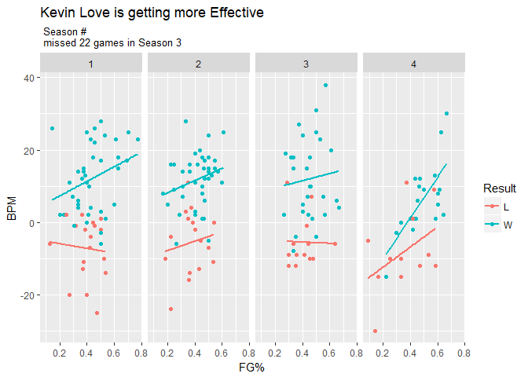

# The Statistical Analysis of Kevin Love 

Kevin Love is catching heat online for no reason, as usual. He falls on his sword, in silence, whenever the Cavs go on a losing streak. 

So to remind everyone not just what Kevin Love gave up to be on the Cavaliers, but also to give the K-lovers some ammo against those who support the war on kevin (JR Smith & sponsors) I've done a statistical analysis on all the small things having Kevin Love does for the Cavaliers. 

YES! I know a true analysis would simulate for Kevin Love's replacement, not just analyze games with and without him, but that's not the point! 

#### The Data 

I went to basketball reference and copy pasted Kevin Love's 4 seasons with the Cavaliers into a csv file. It's on github. I cleaned the data by renaming the columns, making missed games "NA" and splitting results into "Result", "PointDifferential" instead of "W (+3)" it's "W" in one and "+3" in another.


```r
fileUrl <- "https://raw.githubusercontent.com/CR-Mercado/NBA/master/Kevin%20Love%204%20Cavs%20Seasons.csv"
download.file (fileUrl, destfile = "./KLOVE4.csv")

# these are NA strings 
NaStrings <- c ("Did Not Play","Inactive","Not With Team","Did Not Dress")

# Read the data, replace some words with NA 
KevData <- read.csv ("KLOVE4.csv",
          na.strings = NaStrings,
          stringsAsFactors = FALSE)

# A full list of column names 

ColumnNames <- c ("TeamGame",
                  "PlayerGame",
                  "Date",
                  "Age",
                  "Team",
                  "Location",
                  "Opponent",
                  "Result",
                  "PlayerStarted",
                  "MinutesPlayed",
                  "FieldGoalsMade",
                 "FieldGoalsAttempted",
                  "FieldGoalPercentage",
                  "ThreePointsMade",
                  "ThreePointsAttempted",
                 "ThreePointPercentage",
                 "FreeThrowsMade",
                 "FreeThrowsAttempted",
                 "FreeThrowPercentage",
                 "OffensiveRebounds",
                 "DefensiveRebounds",
                 "TotalRebounds",
                 "Assists",
                 "Steals",
                 "Blocks",
                 "Turnovers",
                 "PersonalFouls",
                 "Points",
                 "GameScore",
                 "BoxPlusMinus"
                  )

colnames (KevData) <- ColumnNames
rm (ColumnNames, fileUrl, NaStrings) #declutter environment 

library(tidyr)
NBA.Result.Split <- function(x) {
        # This takes in a dataframe with a column "Result" of form "W (+3)"
        # and splits that column into two columns "W" "+3" 
        # the columns are named "Result" "PointDifferential"
        # function requires tidyr
        
        if (class (x) != "data.frame"){
                stop ("use a data frame")
        }
                
        x <- x %>% separate (Result,          #split the Result column in X
                             c("Result",      #into Result and PointDifferential
                               "PointDifferential"),
                             "\\(")           #they're separated by a "(" 
        
        x$PointDifferential <- gsub ("\\)","", #remove the ")" as well 
                                     x$PointDifferential)
        
        x$PointDifferential <- as.numeric (x$PointDifferential) 
                                                #make the numbers numeric
        
        x$Result <- as.factor (x$Result)        #make the result a factor 
        
        return (x)                               #return the now separated values
}

KevData <- NBA.Result.Split (KevData)

#Replace " " and "@" with "Home" and "Away" respectively
KevData$Location <- ifelse (KevData$Location == "@", "Away","Home")
KevData$Season <- c(rep(1,82),rep(2,82),rep(3,82),rep(4,45)) #add season #
```

### Kevin Love Adds Consistency 

Let's compare apples to apples. Kevin Love has missed games against 21/29 teams in the NBA while on the Cavs. Let's make it fair and only compare Cavs games against those 21 teams for comparison. 

In the 35 games Kevin love's missed in the last 4 seasons the Cavs, here's how the Cavs did with and without him: 


```r
noKev <- KevData[is.na(KevData$PlayerGame), ] #games where KLove didn't play
ComparisonTeams <- unique(noKev$Opponent)
yesKev <- subset (KevData[!is.na(KevData$PlayerGame), ], #games Klove Played
                  Opponent %in% ComparisonTeams) 
#against a team he missed a game against ever. 

par(mfrow = c(1,2))

hist(noKev$PointDifferential, 
     breaks = 35, 
     xlim = c(-40,40),
     xlab = "Point Differential",
     ylab = "Count",
     main = "No Love")
abline (v = mean (noKev$PointDifferential),
                  col = "red")

hist(yesKev$PointDifferential, 
     breaks = 35,
     xlim = c(-40,40),
      xlab = "Point Differential",
     ylab = "Count",
     main = "Yes Love")
abline (v = mean (yesKev$PointDifferential),
                  col = "red")
```

<!-- -->

Look at that giant hole around 0. The blowout nature of loveless games are obvious. Only 2/35 games without Love were decided by less than 5 points compared to 41/186 of games against the same teams with him. A simple t.test shows: this is statistically significant to the .001 level. 


```r
NoLoveCloseGames<- c(1,1,rep(0,33)) # 2 close games, 33 blowouts
YesLoveCloseGames <- c(rep(1,41),rep(0,186-41)) #41 close games, 145 blowouts
t.test(NoLoveCloseGames,YesLoveCloseGames,var.equal = FALSE)
```

```
## 
## 	Welch Two Sample t-test
## 
## data:  NoLoveCloseGames and YesLoveCloseGames
## t = -3.257, df = 80.461, p-value = 0.00165
## alternative hypothesis: true difference in means is not equal to 0
## 95 percent confidence interval:
##  -0.26304999 -0.06352451
## sample estimates:
##  mean of x  mean of y 
## 0.05714286 0.22043011
```

### Kevin Love is Holding Back to be a Team Player

Let's look at the same concept from two angles. 
How many shots does he take on average in WINS vs Losses. 
Does him taking more shots (than average) correlate well with increasing wins and decreasing losses (i.e. increasing the Point Differential)

Below is a simple plot of his field goal attempts in wins and losses. Notice the small blue and red lines between his average and 18. Kevin Love could safely be averaging up to 18 field goal attempts again with almost no effect on the resulting point differential in wins or losses. 

He's giving up his own stats -Not to improve the Team's results (negligible effect) but to keep others involved.


```r
library(ggplot2)
g <- ggplot(data = yesKev,                # Games he played in
            aes(x=FieldGoalsAttempted,    # His FGA
                y = PointDifferential,    # Team Point Differential
                colour = Result))        
                
gg <- g + geom_point() + 
        geom_vline(xintercept = mean(yesKev$FieldGoalsAttempted)) +
        geom_hline(yintercept = mean(yesKev$PointDifferential))
ggg <- gg + geom_smooth(data = subset (yesKev, 
                        FieldGoalsAttempted > mean (FieldGoalsAttempted) &
                                FieldGoalsAttempted <= 18
                        ),
                        method = "lm",se=FALSE
                                )
gggg <- ggg + labs(x = "Kevin FGA",
                   y="Point Differential",
                   title = "Kevin Could Shoot More w/o Hurting Results",
                   subtitle = "Lines at Averages")
gggg
```

<!-- -->

### Kevin Love is still Improving 

Don't get too tunnel-visioned over the raw BPM - that's not adjusted for anything. Notice that the relationship between his FG% and his BPM is getting increasingly positive in both wins and losses. 


```r
yesKev$Date <- as.Date(yesKev$Date)
p <- ggplot(data = yesKev,
            aes(x = FieldGoalPercentage,
                y = BoxPlusMinus,
                colour = Result))
pp <- p  + geom_point() + facet_grid(.~ Season)
ppp <- pp + geom_smooth(method = "lm", se = FALSE)
pppp <- ppp + labs(x = "FG%",
                   y = "BPM",
                title = "Kevin Love is getting more Effective",
                subtitle = " Season # \n missed 22 games in Season 3")
pppp
```

<!-- -->

Shooting accurately is great, but it's irrelevant if they're scoring just as much. At high FG% he's doing better at converting his score into actual Point Differential. This is of course partly because he's playing with Lebron and getting fully comfortable with the playstyle, but part of it is defense. We're seeing hints of a two-way Kevin Love here.  

### Conclusion

Kevin Love is good at basketball. 

